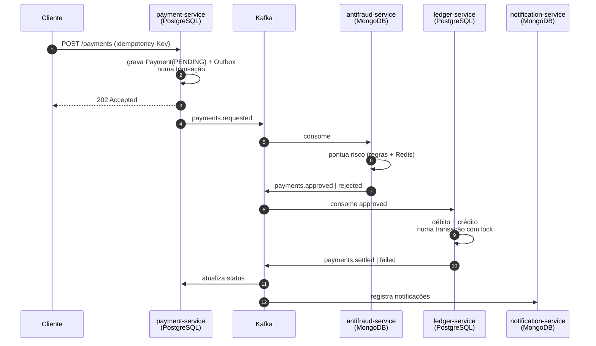

# Mercúrio

Sistema de pagamentos distribuído, orientado a eventos. Quatro microsserviços coordenam uma
transação financeira por mensageria — sem transação distribuída, sem commit em dois bancos.

**Stack:** Java 21 · Spring Boot 3.4 · Apache Kafka · PostgreSQL · MongoDB · Redis · Docker

---

## O problema

Um pagamento precisa que várias coisas aconteçam juntas: o pedido registrado, o risco avaliado, o
dinheiro movido, as partes avisadas. Se cada uma dessas etapas vive num serviço com seu próprio
banco, **não existe transação que abrace todas elas**. Um commit em dois bancos diferentes ou um
`INSERT` seguido de um `send()` para o broker sempre têm uma janela em que os dois discordam.

Mercúrio resolve isso com uma saga coreografada: cada serviço faz sua parte numa transação local e
publica um evento; o próximo reage. Não há orquestrador central — o fluxo emerge dos eventos.



---

## Como rodar

```bash
docker compose up -d --build
```

Sobe Kafka (KRaft, sem Zookeeper), PostgreSQL, MongoDB, Redis e os quatro serviços. A primeira
build leva alguns minutos; depois o stack sobe em ~20s.

Medido nesta máquina, a saga completa (aceite → antifraude → liquidação → status final) leva
**entre 380ms e 550ms**. O primeiro pagamento após uma subida a frio leva alguns segundos a mais,
enquanto os consumer groups terminam o rebalanceamento inicial.

| Serviço | Swagger | Health |
|---|---|---|
| payment-service | http://localhost:8081/swagger-ui.html | :8081/actuator/health |
| antifraud-service | http://localhost:8082/swagger-ui.html | :8082/actuator/health |
| ledger-service | http://localhost:8083/swagger-ui.html | :8083/actuator/health |
| notification-service | http://localhost:8084/swagger-ui.html | :8084/actuator/health |

### Um pagamento de ponta a ponta

```bash
# 1. solicita — responde 202, ainda PENDING
PID=$(curl -s -X POST http://localhost:8081/api/v1/payments \
  -H 'Content-Type: application/json' \
  -H 'Idempotency-Key: pedido-8821' \
  -d '{"payerAccount":"ACC-1001","payeeAccount":"ACC-2002","amount":150.00}' \
  | jq -r .id)

# 2. meio segundo depois, a saga terminou
sleep 2 && curl -s http://localhost:8081/api/v1/payments/$PID | jq '{status, riskScore}'
#=> { "status": "SETTLED", "riskScore": 0 }

# 3. o dinheiro se moveu de verdade
curl -s http://localhost:8083/api/v1/ledger/accounts/ACC-1001 | jq .balance   #=> 9850.00
curl -s http://localhost:8083/api/v1/ledger/accounts/ACC-2002 | jq .balance   #=> 1350.00

# 4. o razão fecha em zero
curl -s http://localhost:8083/api/v1/ledger/integrity | jq
#=> { "signedEntrySum": 0.00, "balanced": true, ... }
```

### Contas de demonstração

| Conta | Titular | Saldo | Situação |
|---|---|---|---|
| `ACC-1001` | Maria Souza | 10.000,00 | ativa |
| `ACC-1002` | João Pereira | 7.500,00 | ativa |
| `ACC-2002` | Loja do Bairro LTDA | 1.200,00 | ativa |
| `ACC-2003` | Serviços Tech ME | 300,50 | ativa |
| `ACC-9999` | Conta Encerrada | 0,00 | **bloqueada** |

Para ver os caminhos de falha: valor acima de 50.000 é barrado pelo antifraude; um pagamento
para `ACC-9999` falha na liquidação; `ACC-2003` pagando mais de 300,50 dá saldo insuficiente.

---

## As decisões que sustentam o sistema

### Outbox transacional — o evento existe se, e somente se, o fato existe

Publicar no Kafka dentro do método de negócio abre uma janela fatal: se a transação do banco falha
depois do envio, o mundo recebeu um evento sobre um fato que não aconteceu; se o envio falha depois
do commit, o fato aconteceu e ninguém soube.

O `payment-service` grava o evento numa tabela `outbox_events` **na mesma transação** que grava o
pagamento. Um relay agendado (`OutboxRelay`) lê os pendentes e entrega ao broker, marcando
`published_at` só depois do ack.

Isso troca "exatamente uma vez" — impossível entre dois sistemas — por "ao menos uma vez" com
deduplicação no consumidor. O relay usa `FOR UPDATE SKIP LOCKED`, então várias réplicas podem
publicar em paralelo sem pegar o mesmo evento.

### Idempotência em três camadas

| Camada | Mecanismo | Protege contra |
|---|---|---|
| API | header `Idempotency-Key` + índice único | o cliente reenviar o pedido |
| Consumo | tabela `processed_events` com o `eventId` como PK | o Kafka reentregar o evento |
| Liquidação | índice único `(payment_id, account_number)` no razão | mover dinheiro duas vezes |

O Redis guarda a chave de idempotência, mas **a garantia é do índice único no banco** — o cache só
evita a ida ao Postgres no caminho quente dos retries, que é quando eles mais acontecem. Com o
Redis fora do ar, o sistema continua correto (há um teste para isso).

Reenviar a mesma chave com o mesmo corpo devolve 200 e o pagamento original; com corpo diferente,
409. Devolver o original seria mentir sobre o que o cliente pediu.

### Partidas dobradas no razão

Toda movimentação grava exatamente duas partidas — um `DEBIT` e um `CREDIT` de igual valor,
ligadas pelo mesmo `transactionId`. A soma com sinal de todas as partidas do razão tem de ser
exatamente zero, e há um endpoint que confere isso (`GET /ledger/integrity`). Qualquer outro valor
denuncia lançamento desbalanceado.

As duas contas são travadas **sempre na mesma ordem alfabética**. Sem isso, dois pagamentos
cruzados simultâneos (A→B e B→A) travariam um no outro. Há um teste que verifica a ordem.

### Falha de negócio não é exceção

Saldo insuficiente é um desfecho previsto da saga, não um erro a reprocessar. Se o `SettlementService`
lançasse exceção, o evento iria para a DLT e o pagamento ficaria preso em `APPROVED` para sempre.
Em vez disso, ele retorna um `PaymentFailed` que segue o fluxo normal e chega ao cliente.

### Máquina de estados que não retrocede

O Kafka garante ordem por partição, mas uma reentrega pode chegar depois de um estado terminal.
`PaymentStatus` declara as transições válidas: um `PaymentApproved` atrasado, chegando depois do
`SETTLED`, é descartado sem erro em vez de retroceder o pagamento.

### Por que dois bancos

**PostgreSQL** onde a consistência é inegociável: pagamentos e razão, com `CHECK (balance >= 0)`,
locks pessimistas e schema versionado por Flyway. **MongoDB** onde o formato varia: cada regra de
risco acrescenta campos próprios ao laudo, e cada tipo de notificação carrega metadados
diferentes — num schema relacional isso viraria uma tabela larga de colunas nulas.

Não é MongoDB por moda: é o modelo de documento resolvendo o caso em que ele de fato ganha.

---

## Um bug real encontrado durante a construção

Vale registrar porque é o tipo de defeito que só aparece com infraestrutura de verdade.

Os primeiros testes manuais passaram — um pagamento completou a saga em 900ms. Mas ao disparar
vários pagamentos, alguns ficavam presos em `PENDING` **para sempre**.

A causa: os consumidores subiam antes de o tópico existir, e o broker (com `auto.create.topics`
ligado) o criava com **uma partição**. Quando o `payment-service` depois declarava 3 partições, o
consumer group já tinha metadata antiga e só a partição 0 ficava atribuída. As partições 1 e 2
ficavam **órfãs** — e todo pagamento cuja chave caísse nelas nunca era consumido.

```
GROUP              TOPIC                        PARTITION  LAG
antifraud-service  mercurio.payments.requested  0          0     <- só esta
                                                (1 e 2 sem consumidor)
```

A correção teve três partes:

1. `auto.create.topics.enable=false` no broker — criação implícita com defaults é uma armadilha;
2. **todos** os serviços declaram **todos** os tópicos no start (`TopicsConfig`), inclusive os que
   não usam e as DLTs, então quem subir primeiro cria com a configuração certa;
3. `metadata.max.age.ms=30000` nos consumidores (default: 5 min), para que uma mudança de
   partições seja percebida rápido.

---

## Testes

```bash
mvn test      # 42 testes, sem Docker
mvn verify    # + 3 de integração com Postgres, Kafka e Redis reais
```

**Sem Docker** — `RiskEngineTest` (11): limiares de valor, janela de velocidade, lista de bloqueio,
teto da pontuação, e o comportamento com Redis fora do ar. `SettlementServiceTest` (11): partidas
que se anulam, saldo exato, conta inativa, moeda incompatível, idempotência e ordem de travamento.
`PaymentServiceTest` (11) e `PaymentStatusTest` (9): idempotência real com Redis falhando, corrida
no índice único, transições inválidas descartadas.

**Com Docker** — `PaymentOutboxIT` (3): sobe PostgreSQL, Kafka e Redis via Testcontainers e prova
que o pagamento aceito vira evento publicado com o `paymentId` como chave de partição, que um retry
não gera segundo evento, e que um pedido recusado não deixa nada na outbox.

> `testcontainers.version` está fixado em 1.21.4: versões anteriores enviam uma versão da Docker
> Engine API que o Docker 29 recusa com HTTP 400.

---

## Estrutura

```
mercurio-contracts/     eventos compartilhados (sem Spring — só records e Jackson)
payment-service/    :8081  API, outbox, máquina de estados        PostgreSQL + Redis
antifraud-service/  :8082  motor de risco, laudos                 MongoDB + Redis
ledger-service/     :8083  partidas dobradas, saldos              PostgreSQL + Redis
notification-service/:8084 avisos das partes                      MongoDB
```

Cada serviço tem **seu próprio banco** — nenhum lê as tabelas do outro por atalho, o que forçaria
acoplamento pela base. A comunicação é só por evento.

### Tópicos

| Tópico | Produtor | Consumidores |
|---|---|---|
| `mercurio.payments.requested` | payment | antifraud |
| `mercurio.payments.approved` | antifraud | ledger, payment |
| `mercurio.payments.rejected` | antifraud | payment, notification |
| `mercurio.payments.settled` | ledger | payment, notification |
| `mercurio.payments.failed` | ledger | payment, notification |

3 partições cada, chaveados por `paymentId` — o que dá paralelismo entre pagamentos e ordem
garantida dentro de cada um. Cada tópico tem uma `.DLT` para mensagens que esgotaram as tentativas:
uma mensagem envenenada não pode travar a partição inteira.

---

## Variáveis de ambiente

| Variável | Padrão | Descrição |
|---|---|---|
| `KAFKA_BOOTSTRAP` | `localhost:9092` | Endereço do broker |
| `DB_URL` / `DB_USERNAME` / `DB_PASSWORD` | `mercurio` | PostgreSQL (payment e ledger) |
| `MONGO_URI` | `mongodb://localhost:27017/...` | MongoDB (antifraud e notification) |
| `REDIS_HOST` / `REDIS_PORT` | `localhost` / `6379` | Redis |
| `OUTBOX_POLL_INTERVAL` | `500` | Intervalo do relay, em ms |
| `BLOCKED_ACCOUNTS` | `ACC-6666` | Contas em lista de bloqueio |
| `LOG_LEVEL` | `INFO` | Nível de log da aplicação |

As portas do Compose são deslocadas (`5433`, `6380`, `27018`, `29092`) para não conflitar com
instâncias locais de Postgres, Redis ou Mongo.

---

## O que este projeto não faz

Escopo declarado de propósito, porque um portfólio honesto diz onde parou:

- **Sem autenticação.** As APIs são abertas. O foco aqui é a arquitetura distribuída; JWT e RBAC
  estão demonstrados no [Banking API](https://github.com/Inacioluz/Banking-API).
- **Sem envio real de e-mail ou SMS.** O `notification-service` registra o que seria enviado.
  Integrar um provedor acrescentaria credenciais e um ponto de falha externo sem mudar a arquitetura.
- **Regras de risco determinísticas, não um modelo estatístico.** Um modelo tornaria os testes
  instáveis sem acrescentar nada ao que o projeto demonstra.
- **Um broker, uma réplica.** `replicas=1` é o máximo possível com um nó. Em produção seriam 3, com
  `min.insync.replicas=2`.
